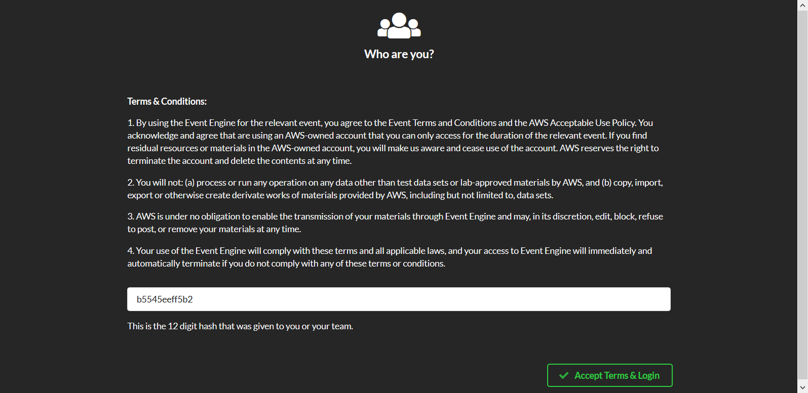
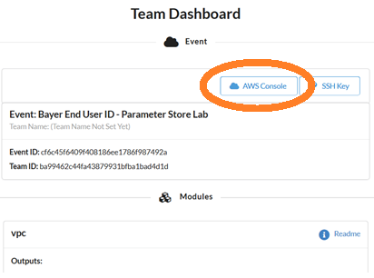
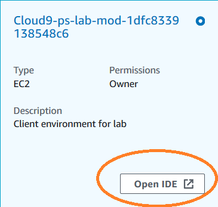
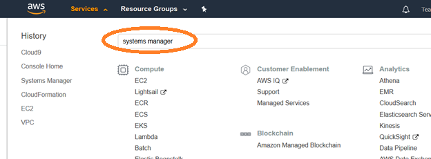
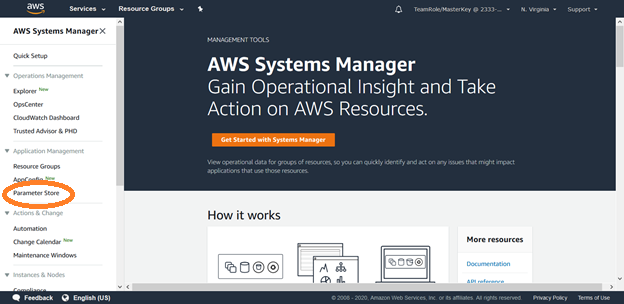
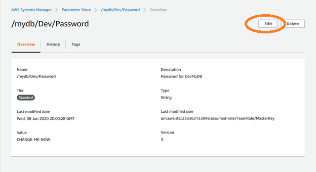
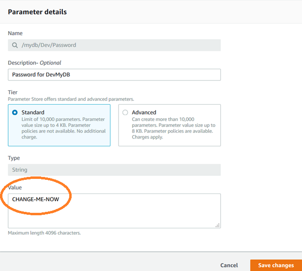

# Parameter Store workshop


## Workshop progress

**Lab 1: Add your Secrets to Parameter Store**

[Lab 2: Operationalize Observability - Aggregate Metrics](../lab2)

[Lab 3: Create an Aurora Serverless MySQL cluster](../lab3)


## LAB 1 - Parameter Store

Parameter Store, part of AWS Systems Manager, provides a secure depot for managing credentials and configuration details.  Among the challenges of distributed applications development is how to keep configuration and credentials details consistent across a wide variety of technologies such as Infrastructure as Code (CloudFormation, Teraform), traditional applications on virtual machines, containers, and serverless.

In this first lab, we will create parameters.

Start by logging into to [Event Engine](https://dashboard.eventengine.run/login).

Enter your 12-digit hash and Accept.


.


Select AWS Console. 





And again on the Team Dashboard, select Console 


From the AWS console, navigate to Cloud8 and "Open IDE"



When Cloud9 initializes, it will *automatically* download the github content from https://github.com/dotstar/parameter-store.

Time to initialize our parameters.  We are going to create a MySQL database with administrative access managed by Parameter Store.

1. Create Parameters

One would normally type in parameters one at a time, from the GUI, CLI, API, or CloudFormation.  For this lab, there is a helper script to speed things up a bit.

In the command line of Cloud9, run the helper script.

<details>
<summary>HINT</summary>

**Press ALT-t to open a larger terminal window**
</details>


<pre>
  cd ~/environment/parameter-store/lab1
  python init-parms.py
</pre>

The expected output from running these commands:
```
here are your parameters, from the parameter store:
[  {  'ARN': 'arn:aws:ssm:us-east-1:233363133948:parameter/mydb/Dev/Login',
      'LastModifiedDate': datetime.datetime(2020, 1, 8, 20, 0, 28, 944000, tzinfo=tzlocal()),
      'Name': '/mydb/Dev/Login',
      'Type': 'String',
      'Value': 'admin',
      'Version': 2},
   {  'ARN': 'arn:aws:ssm:us-east-1:233363133948:parameter/mydb/Dev/Password',
      'LastModifiedDate': datetime.datetime(2020, 1, 8, 20, 0, 28, 987000, tzinfo=tzlocal()),
      'Name': '/mydb/Dev/Password',
      'Type': 'String',
      'Value': 'CHANGE-ME-NOW',
      'Version': 3},
   {  'ARN': 'arn:aws:ssm:us-east-1:233363133948:parameter/mydb/Prod/Login',
      'LastModifiedDate': datetime.datetime(2020, 1, 8, 20, 0, 29, 66000, tzinfo=tzlocal()),
      'Name': '/mydb/Prod/Login',
      'Type': 'String',
      'Value': 'admin',
      'Version': 2},
   {  'ARN': 'arn:aws:ssm:us-east-1:233363133948:parameter/mydb/Prod/Password',
      'LastModifiedDate': datetime.datetime(2020, 1, 8, 20, 0, 29, 105000, tzinfo=tzlocal()),
      'Name': '/mydb/Prod/Password',
      'Type': 'String',
      'Value': 'CHANGE-ME-NOW',
      'Version': 2}]

```

<details>
Here is the code to our helper script.  It parses values from a JSON input file and calls put_parameter() to copy these values to Parameter store.  Note the use of a hierarchy of parameters.  There is on tree for _Pub_ and a seperate one for _Dev_ instances.  In the real world, we would likely have different permissions for each of these paths, so that the whole world wouldn't have access to production credentials.

```
import boto3
from pprint import pprint
import json


inputfile = "parameters.json"
topkey = '/mydb'
ps = boto3.client('ssm',region_name='us-east-1')


if __name__ == '__main__':
   with open(inputfile,"r") as myfile:
      data = myfile.read()
   obj = json.loads(data)
   # print (obj)

   # Initialize Parameters for Dev
   try:
      for env in ['Dev','Prod']:
         # Put login information into parameter store
         ps.put_parameter(
            Name = topkey + '/' + env + '/'+ 'Login',
            Description = "Login for " + env + "MyDB",
            Value = obj[env]['Login'],
            Type = 'String',
            Overwrite = True
         )
         # Put password information into parameter store
         ps.put_parameter(
            Name = topkey + '/' + env + '/'+ 'Password',
            Description="Password for " + env + "MyDB",
            Value = obj[env]['Password'],
            Type = 'String',
            Overwrite=True
         )
   except Exception as e:
      print(e)
      print('exiting')
      exit

   print('contents of {} key in parameter store:'.format(topkey))
   r = ps.get_parameters_by_path(
      Path=topkey,
      Recursive=True,
      MaxResults=10
   )
   print('here are your parameters, from the parameter store:')
   pprint(r['Parameters'],indent=3)

````
</details>

2. Change a parameter

Let's change the value of the development database password in Parameter Store.  We will use the GUI, but of course you could do this via API or CloudFormation, if desired.

Navigate to the parameter store service.  Parameter store is part of AWS System Manager.  From the console, you can enter "parameter" or "ssm" or "systems manager".






For this workshop, we will build an Aurora Serverless Database from Cloudformation.  Cloudformation will obtain the administrative credentials from Parameter store.
Select the Parameter /mydb/Dev/Password and edit the password.  Save it when you are complete, and don’t forget what you typed.  You will use it later.

Hint - the password needs to be one which MySQL accepts.  By the default, the constraints on the master password are:
##At least 8 printable ASCII characters. Can't contain any of the following: / (slash), "(double quote) and @ (at sign)##







3. Check your work

Return to the CLI (in Cloud9) , inspect parameter store to validate that the login and password are as you set them.

<pre>
  aws ssm get-parameters-by-path --path /mydb --recursive
</pre>

When you are satisfied that you’ve changed the Dev password, proceed to lab2, creating a database

### Checkpoint

Congratulations!!!  You've successfully added parameters and edited the default administrative password. On to the next lab!

Proceed to [Lab 2](../lab2)!

[*^ back to top*](#lab2)

## Participation

We encourage participation; if you find anything, please submit an [issue](https://github.com/dotstar/parameter-store/issues). However, if you want to help raise the bar, submit a [PR](https://github.com/dotstar/parameter-store/pulls)!

<!--## License

This library is licensed under the Apache 2.0 License.
-->