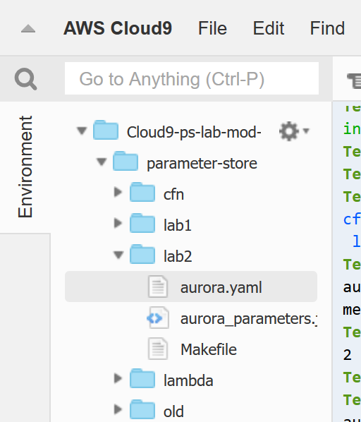
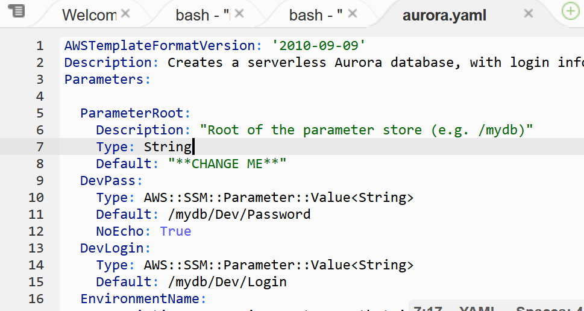
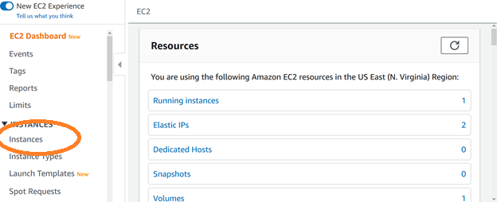
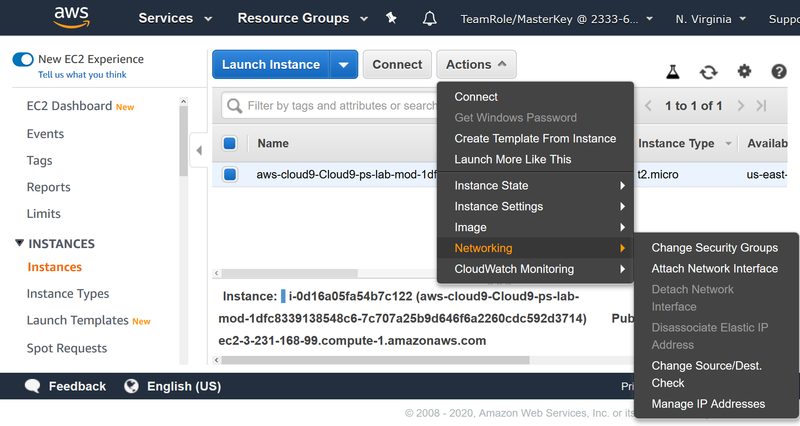
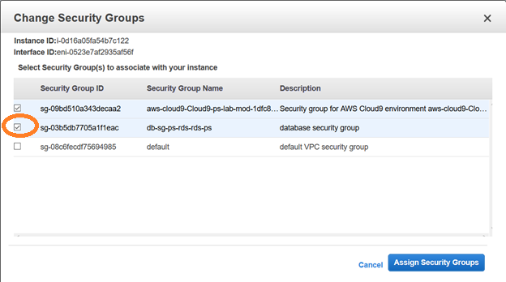

# Parameter Store workshop


## Workshop progress

✅[Lab 1: Add your secrets to Parameter Store](../lab1)

**Lab 2: Create an Aurora Serverless MySQL cluster**

[Lab 3: Access Parameters from your code](../lab3)


## Lab 2: Create an Aurora Serverless MySQL cluster

In this lab, we will modify a CloudFormation template to use the parameters you just edited.

## 1. Setup CloudFormation Template

In this first lab, we will create a Serverless MySQL database using our _Dev_ parameters.  We need to edit the CloudFormation template file, ~/environment/parameter-store/lab2/aurora.yaml.

<details>
We could have used any database, or other AWS service which requires credentials or configuration detail.  


The lab is using a serverless version of Aurora for it's unique ability to scale to 0.  With Serverless Aurora, after a period of time when there are no connections to the database, it shutsdown.  This is particularly valuable for a development or lab database, as it is very cost effective.  When the database is down, you pay for only the storage used.  It's a simple, cost-effective option for infrequent, intermittent, or unpredictable workloads.

When a connection is received, the database restarts.  The database restart time is elongated, typically between 20 and 40 seconds.  After this one _"cold start"_, connection times are comparable with other MySQL databases.
</details>


One way to edit a file in cloud9, is to navigate to lab2 in Cloud9's left panel, and double click on the file named **aurora.yaml.**

<div align="center">


.

</div>


Edit the template parameter named “ParameterRoot”.  **Set the default value to the root of your parameter store _/mydb_**.


<div align="center">



</div>

Note that the following two template parameters have been pre-populated to set variables DevPass and DevLogin from the Parameter Store.

Save the CloudFormation template, and create a stack.  The stack will create an Aurora MySQL serverless database, and a lambda function.  We’ll come back to the lambda in the next lab.

## 2. Create the database, using CloudFormation

We will invoke CloudFormation from the CLI.

Issue the commands to create a CloudFormation stack:

<pre>
cd ~/environment/parameter-store/lab2

aws cloudformation create-stack --stack-name rds-ps --template-body file://aurora.yaml --capabilities CAPABILITY_NAMED_IAM

</pre>

The CLI returns output similar to:
```
{
    "StackId": "arn:aws:cloudformation:us-east-1:233363133948:stack/rds-ps/e3a1a080-3259-11ea-a41e-0af77bd56d08"
}

```


**It takes several minutes to create the database.  Navigate to CloudFormation on the console to monitor progress.**

## 3. Enable your Cloud9 instance to network with the database

After CloudFormation instantiates the database, we are ready to use it.

Before we can connect the Cloud9 terminal to the database, we need to give it network access.  Add your cloud9 instance to the security group with name similar to _db-sg-ps-rds-rds-ps_.  This security group allows inbound access to port 3306, which is the default MySQL listener.  By adding your cloud9 instance to this SG, you are enabling it to talk to the database.

Navigate to EC2 in the console.

<div align="center">



</div>

Select your cloud9 instance and Actions -> Networking -> Change Security Groups


<div align="center">







</div>

## 4. Test database connectivity

After CloudFormation instantiates the database, we are ready to use it.  

**Make sure the CloudFormation build is complete before proceeding.**

Typically with MySQL, the CLI syntax is similar to:
``` Mysql -h database-hostname -u user -p password ```

You could use this syntax to connect.  To do this, we’d need to lookup the name of the database which was just created and either recall the username/password combination or retrieve that information from the database.

For this lab, we’ve created a helper script which lookups up these details for you, called wrap-mysql.  Since this is a lab, we’re printing the login and password to the terminal.  Obviously you wouldn’t do that in real life.

<details>

The wrapper script pulls the hostname from CloudFormation's output and gets login/password information from Parameter store.  Here is the wrapper script:
```
#!/bin/bash

# Get the database name from cloudformation export
host=$(aws cloudformation list-exports --query 'Exports[][Name,Value]' --output text | grep DevDB-Endpoint | cut -f 2)
echo host: $host

# Get login and password information from parameter store
user=$(aws ssm get-parameter --name /mydb/Dev/Login --query Parameter.Value  --output text)
password=$(aws ssm get-parameter --name /mydb/Dev/Password --query Parameter.Value  --output text)

echo user: $user
echo password: $password

# set the password as MySQL default password
# by creating a new $HOME/.my.cnf
cat - > ~/.my.cnf << EOF
[client]
password=$password
EOF
mysql -u $user -h $host 

```
</details>

Connect to the database.  From the CLI, call the wrapper script, as follows:

<pre>
cd ~/environment/parameter-store/lab2
./wrap-mysql
</pre>

When you are connected, you should see output similar to:

```
host: devdbcluster-rds-ps.cluster-cqhyviwu3hz1.us-east-1.rds.amazonaws.com
user: admin
password: CHANGE-ME-NOW
Welcome to the MySQL monitor.  Commands end with ; or \g.
Your MySQL connection id is 9
Server version: 5.6.10 MySQL Community Server (GPL)

Copyright (c) 2000, 2018, Oracle and/or its affiliates. All rights reserved.

Oracle is a registered trademark of Oracle Corporation and/or its
affiliates. Other names may be trademarks of their respective
owners.

Type 'help;' or '\h' for help. Type '\c' to clear the current input statement.

mysql> 
```


**Type exit, or ^D to exit.**

Let's add some data to the database.

<pre>
cd ~/environment/parameter-store/lab2
./wrap-mysql < create-table.sql
</pre>

Now validate that the insert worked.

<pre>
cd ~/environment/parameter-store/lab2
./wrap-mysql < describe-table.sql
</pre>

<details>

This should result in the following output:
```
host: devdbcluster-rds-ps.cluster-cqhyviwu3hz1.us-east-1.rds.amazonaws.com
user: admin
password: CHANGE-ME-NOW
Field   Type    Null    Key     Default Extra
customer_id     int(11) NO      PRI     NULL    auto_increment
first_name      varchar(255)    YES             NULL
last_name       varchar(255)    YES             NULL
street_address  varchar(255)    YES             NULL
city    varchar(255)    YES             NULL
state   varchar(255)    YES             NULL
zip     varchar(10)     YES             NULL
customer_id     first_name      last_name       street_address  city    state   zip
1       Jane    Smith   1 South Main    Springfield     OH      43215
2       John    Smith   1 South Main    Springfield     IL      43215
3       Amy     Simpson 11 South Main   Springfield     MO      43215
4       Jack    Frank   12 South Main   Springfield     TX      43215

```

</details>

Now that you’ve created a database and added a small table, time to move to [lab3](../lab3), using parameter store from your applications.


### Checkpoint

Congratulations!!!  You've successfully created a database based on the parameters you added in lab1.  Time to go to the next lab.

Proceed to [Lab 3](../lab3)!

[*^ back to top*](#lab2)

## Participation

We encourage participation; if you find anything, please submit an [issue](https://github.com/dotstar/parameter-store/issues). However, if you want to help raise the bar, submit a [PR](https://github.com/dotstar/parameter-store/pulls)!

<!--## License

This library is licensed under the Apache 2.0 License.
-->